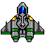
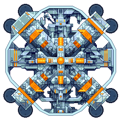

# Game Design Document
----
#Overall Gameplay
The player will start at the bottom of the screen when the game begins. Asteroids will fall from the top of the screen towards the
player. The player must dodge or shoot the asteroids. Alien spaceships will move onto the screen and attack the player in 
different ways. The player must dodge the attacks and can shoot the aliens.

After a certain amount of time, the asteroids and aliens will leave, and there will be a boss fight. The boss will be 
at the top of the screen, and will fire a variety of attacks at the player. The boss fight will be next to impossible,
but if the player wins, they will win the game. 

Have fun!

###The Player

##Things in the Game
2. Basic Aliens
	*The basic aliens will fly across the screen firing at the player
	
	
	
	
2. Diving Aliens
	*The diving aliens will dive from the top, drop a missile, and fly off at a random direction
	
	
	
3. Bullets
	*The bullets will fire down or up, depending on whether an enemy or player shot them
	*They will destroy whatever they collide with
	
	
	
3. Missiles
	*The missiles will fall down, and explode when they hit the bottom of the screen
	*If the explosion hits the player, the player will die
	
	
		
3. Laser
	*The laser will be stationary
	*Sometimes it will be invisible, or charging (red), and do no damage
	*If the player is hit by the blue laser, the player will die
	
	
	
	
4. Asteroids
	*Asteroids will fall from the top of the screen straight down
	*Some asteroids will be larger
	
	
	
	
5. Boss Alien Ship
	*There will be one boss in the game
 	*The boss will move at first, and then be stationary
 	*It will fire bullets and a laser at the player
 	*It will take 100 hits to kill the boss
 	
 	

##Control Scheme
1. The left and right arrowkeys or A and D will be used to move the player's ship to the left and right, respectively
2. The Spacebar will be used to fire bullets at the enemies
4. The P key will be used to pause the game

##Score
The score can change in the following ways:
1. Shooting an asteroid +1 point
5. Shooting a falling missile +1 point
1. Shooting a falling bullet +1 point
2. Shooting a large asteroid +2 points
3. Shooting a basic alien ship +3 points
4. Shooting a divebombing alien ship +3 point
6. Shooting the boss alien ship +5 points
7. Destroying the boss ship +500 points
8. Losing a life -5 points

##Lives
The player will contain an int that will measure the number of lives that they have left
Their lives go down on:
1. Collision with an asteroid
2. Collision with an alien ship
3. Collision with a bullet
4. Collision with a missile
5. Being hit by a missile's explosion
5. Collision with the laser
The game will be over once the player has lost all of their lives.
When they lose a life, the screen will clear, and then the player can continue the game

##Interface
The basic interface will consist of one view
The view will contain:
* A box with the instructions
* A name field
* A start button that only works once the name field has been filled
* A quit button that exits the game
* A pause button that pauses the game
* A box containing the top scores for the game

###Classes
* A MainWindow class
* A GameScene class that will be a QGraphicsScene
* A generic object class for all game objects
* A player object class
* A dive-bombing alien object class
* A basic alien spaceship object class
* A basic bullet object class
* A missile object class
* A laser object class
* A large asteroid object class
* A boss ship object class
* An asteroid object class
